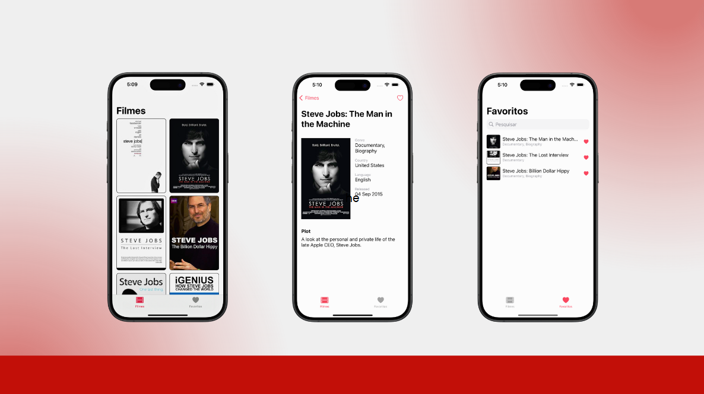

<h1 align="center">
  <br>
  
  <br>
</h1>

<h4 align="center">a mobile application to search and rate films </h4>

<p align="center">
  <a href="#key-features">Key Features</a> •
  <a href="#how-to-use">How To Use</a> •
  <a href="#download">Download</a> •
  <a href="#credits">Credits</a> •
  <a href="#team">Team</a> •
  <a href="#license">License</a>
</p>



## Key Features

We were invited by the Instituto de Pesquisa Eldorado to participate in a Swift mini residency. During this residency, we worked on an ongoing project and improved it over the course of two sprints. The project is an app where you can search for movies through an API. In the initial version, only searches were possible. In the version we implemented, we added the following features:

- Movie ratings
- Adding movies to a wishlist
- Empty states for all screens
- Sorting options
- Search functionality for TV series
- Detailed descriptions including cast and directors
- And more

## How To Use

To clone and run this application, you'll need [Git](https://git-scm.com) and [Swift](https://developer.apple.com/swift/) installed on your mac computer. From your command line:

```bash
# Clone this repository
$ git clone git@github.com:lucasmartt/movies-ios-app.git

# Go into the repository
$ cd movies-ios-app

# Run the app
$ open movies-ios-app.xcodeproj
```

## Download

You can [download](https://testflight.apple.com/join/rCmeQSRX) the latest installable version of SwiftFlix ios.

## Credits

This application uses the following technologies:

- [Swift](https://developer.apple.com/swift/)
- [Xcode](https://developer.apple.com/xcode/)
- [API de filmes](https://www.omdbapi.com/)
- [Jira](https://www.atlassian.com/software/jira)

## Team

[Igor Vicente](https://github.com/iMarVic) - Mentor <br>
[Eduardo Zamit](https://github.com/eduardozamit) - Developer <br>
[Jean Pierre](https://github.com/JPTR2189) - Developer <br>
[Lucas Martins](https://github.com/lucasmartt) - Developer <br>
[Denison Barcelos](https://github.com/Denibf) - Developer <br>
[Gabriel Kretzmann](https://github.com/Kretzmann01) - Developer <br>
[Eduardo Fettermann](https://github.com/eduardofettermann) - Developer <br>


---

## License

MIT

---
